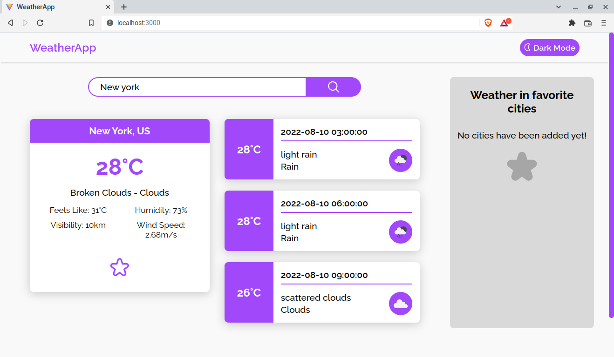

# Weather App
A weather application developed with HTML, CSS/SASS and JavaScript, making use of ViteJS.

View it here: https://remy349.github.io/weather-app/

## Project description
Simple, do you want to know what the weather is like in your city or any other city?
Just type the name of the city in the search bar and it will show you the weather data
at that moment and in the next hours.

This project has a responsive design so it is adaptable to mobile devices.
In my opinion, I recommend you to view it from a mobile device, it looks great.

## Technologies used in the development
In this project I made use of the following technologies: HTML, CSS/SASS, JavaScript and OpenWeatherMap API.

If you wanna run this project locally on your computer/laptop, do the following:
- Requires NodeJS to be installed and an API key from OpenWeatherMap
- You can get the API key by creating your free account from here: https://home.openweathermap.org/users/sign_up
- Create an .env file and add VITE_API_KEY=yourapikey

```
git clone https://github.com/Remy349/weather-app.git
cd weather-app
npm install
npm run dev
```

## This is a preview


## For the future
I will keep working on improving the application, I really like the way it looks so I will keep
dedicating time to it in the future. There are many things to improve:
- Complete the "Favorite Climates" section
- Improve the search method
- Implement dark mode
- And more...

### Created by
#### Santiago de Jesús Moraga Caldera - Remy349
